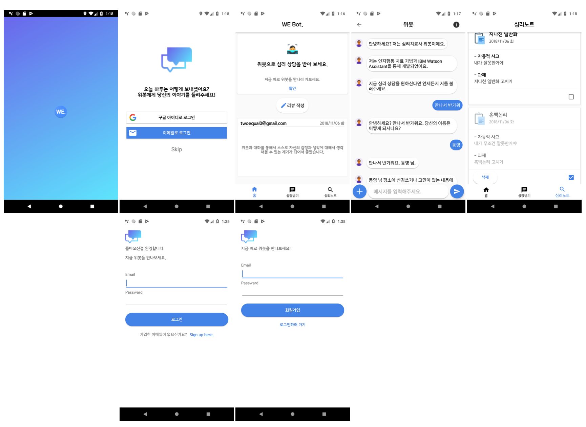
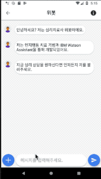
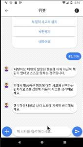

# WE Bot

> IBM Cloud Watson Assistant를 이용한 안드로이드 심리 챗봇입니다.

심리 상담이 가능하도록 설계한 챗봇 기능과 심리 노트를 작성할 수 있는 기능을 가진 안드로이드 어플입니다.



## 개발 환경

* Android Studio 3.1.4
  * Compile Sdk Version : API 27(Android 8.1(Oreao))
* Java Sdk 1.8
* IBM Cloud
  * Watson Assistant 6.7.0
  * IBM Cloud Java Sdk 6.7.0
* Firebase 11.6.2
  * Remote Config
  * Auth
  * Real time database
* Library
  * butterknife 8.8.1
  * gson 2.8.5

## 기능 설명


### 챗봇

대화 흐름은 우울증 치료로 사용되는 인지행동치료 기법을 토대로 설계했습니다. 메시지 인터페이스 구성을 텍스트 응답과 닫힌 선택지 응답이 가능하도록 설계했습니다.



### 심리 노트

챗봇과 대화를 나누면서 알게된 생각들에 대해서 기록할 수 있는 기능입니다. 챗봇 화면에서 하단 좌측 플러스 버튼을 통해서 사용할 수 있습니다.



## 사용 방법

### Firebase

먼저 사용하기 위해서는 구글 계정이 필요합니다. 직접 생성한 firebase와 연동하기 위해서는 기존 [google-services.json](./chatbot/Webot/app/google-services.json)를 제거하신 후 생성하신 json 파일을 추가하면 됩니다.

* [firebase 가이드 사이트](https://firebase.google.com/docs/android/setup?authuser=0)

### Watson

[왓슨으로 쉽게 개발하는 카카오톡 챗봇](https://developer.ibm.com/kr/watson/2017/01/13/watsonchatbot-1-watson-conversation/)을 참고하시면 전체 과정과 챗봇을 설계하는데 필요한 개념인 인텐트, 엔티티 그리고 대화상자에 대해서 학습하실 수 있습니다.

IBM Cloud에서 제공하는 java sdk를 통해서 아래 코드와 같이 자신이 설계한 챗봇 서버로 부터 응답을 받아올 수 있습니다.

```android code
Assistant service = new Assistant("2018-09-20");
service.setUsernameAndPassword(watsonUsername, watsonPassword);
InputData input = new InputData.Builder(strInputMessage).build();
MessageOptions options = new MessageOptions
                        .Builder(workspacesId)
                        .input(input)
                        .context(context)
                        .build();
MessageResponse response = service.message(options).execute();
```

챗봇 서버에 연결하기 위해 필요한 watsonUsername, watsonPassword 그리고 workspaceId는 [인증 리소스 파일](./chatbot/Webot/app/src/main/res/values/credentials.xml)에서 설정할 수 있습니다.

설계한 Watson Assistant workspace에 대한 [json](./doc/webot_workspace.json) 파일입니다. 본인의 workspace에 import해서 사용하실 수 있습니다.

* [IBM Cloud API Docs - Watson Assistant v1](https://console.bluemix.net/apidocs/assistant)

## 업데이트 내역

* 0.0.1
  * 프로젝트 배포

## 참고

* [AI Dev - 인공지능 개발자 모임](http://aidev.co.kr/)